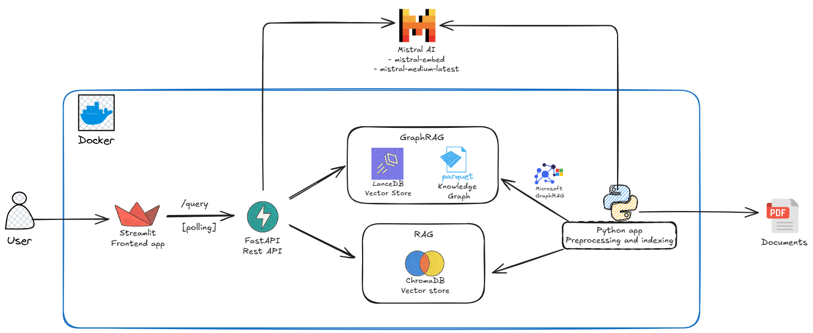

# RAG of Ice and Fire 🐉

A comprehensive Retrieval-Augmented Generation (RAG) system built around Game of Thrones/A Song of Ice and Fire content, comparing traditional RAG approaches with Microsoft's GraphRAG implementation.

## 🎯 Overview

This project implements and compares two RAG methodologies:
- **Traditional RAG**: Uses ChromaDB with vector embeddings and semantic search
- **GraphRAG**: Microsoft's graph-based approach that builds knowledge graphs for enhanced contextual understanding

Both systems are trained on Game of Thrones chapter summaries and provide a web interface for querying the knowledge base.

## 🏗️ Architecture



The system architecture demonstrates how both RAG approaches integrate within a containerized environment:

- **Frontend**: Streamlit application for user interaction
- **Backend**: FastAPI service handling query routing and processing
- **Traditional RAG**: ChromaDB vector store with semantic similarity search
- **GraphRAG**: Knowledge graph construction with entity relationships and community detection
- **LLM Integration**: Mistral AI for embeddings and text generation
- **Containerization**: Docker compose for easy deployment and scaling

```
rag-of-ice-and-fire/
├── api/                    # FastAPI backend
├── app/                    # Streamlit frontend
├── preprocessing/          # Data processing notebooks
├── graphragtest/          # GraphRAG configuration and data
├── rag/                   # Traditional RAG data (ChromaDB)
├── assets/                # Architecture diagrams and images
└── data/                  # Source PDF files
```

## 🕸️ Understanding GraphRAG: Why It Matters

### What is GraphRAG?

GraphRAG represents a paradigm shift from traditional vector-based retrieval to knowledge graph-powered understanding. Instead of relying solely on semantic similarity between query and document chunks, GraphRAG constructs a comprehensive knowledge graph that captures:

- **Entities**: Characters, locations, events, concepts
- **Relationships**: How entities connect and interact
- **Communities**: Clusters of related entities and their contexts
- **Hierarchical Understanding**: Multi-level reasoning from specific facts to broad themes

### Key Advantages of GraphRAG

#### 1. **Enhanced Contextual Understanding**
Traditional RAG might retrieve isolated facts about "Jon Snow" or "Daenerys Targaryen" separately. GraphRAG understands their complex relationship network - family ties, political alliances, shared history, and mutual influences.


#### 2. **Global vs Local Search Capabilities**

**Local Search**: 
- Focuses on specific entities and their immediate relationships
- Ideal for direct factual queries
- Example: "Who are Tyrion Lannister's siblings?"

**Global Search**:
- Analyzes broader themes and patterns across the entire knowledge base
- Perfect for thematic analysis and complex theories
- Example: "What are the recurring themes of power and corruption in Westerosi politics?"

#### 3. **Community Detection**
GraphRAG automatically identifies communities of related entities, enabling:
- Analysis of political factions and their dynamics
- Understanding of geographical and cultural clusters
- Identification of thematic groups (e.g., magic users, military leaders, etc.)


### When to Use Each Approach

**Choose Traditional RAG for:**
- Quick factual lookups
- Simple question-answering
- When computational resources are limited
- Direct information retrieval tasks

**Choose GraphRAG for:**
- Complex analytical queries
- Relationship exploration
- Thematic analysis and pattern recognition
- Multi-entity reasoning tasks
- Theoretical discussions and speculation

## 🚀 Quick Start with Docker

1. **Clone the repository**
   ```bash
   git clone <repo-url>
   cd rag-of-ice-and-fire
   ```

2. **Set up environment variables**
   ```bash
   cp .env.example .env
   # Edit .env with your API keys
   ```

3. **Run with Docker Compose**
   ```bash
   docker-compose up --build
   ```

4. **Access the applications**
   - Streamlit UI: http://localhost:8501
   - FastAPI docs: http://localhost:8000/docs

## 🛠️ Local Development Setup

### Prerequisites

- Python 3.10+
- PDF source data in `data/` directory

### 1. Environment Setup

```bash
# Create virtual environment
python -m venv venv
source venv/bin/activate  # Linux/Mac
# or
venv\Scripts\activate     # Windows

# Install dependencies
pip install -r requirements.txt
```

### 2. Configure Environment Variables

Create a `.env` file in the project root:

```env
# Required for both GraphRAG and traditional RAG
GRAPHRAG_API_KEY=your_mistral_api_key_here

# Optional: API configuration
API_URL=http://localhost:8000
```

### 3. Data Preprocessing

#### Extract Text from PDF
```bash
cd preprocessing
python pdf_extractor.py
```

#### Set up GraphRAG
```bash
# Initialize GraphRAG configuration
graphrag init --root ./graphragtest

# Tune prompts for Game of Thrones domain
graphrag prompt-tune --root ./graphragtest --config ./graphragtest/settings.yaml --domain "Game of Thrones chapter summaries"

# Build the knowledge graph
graphrag index --root ./graphragtest
```

#### Set up Traditional RAG
Run the `preprocessing/naive_rag_indexing.ipynb` notebook to:
- Load and chunk the text data
- Generate embeddings using Mistral AI
- Store vectors in ChromaDB

### 4. Run the Applications

#### Backend API
```bash
cd api
uvicorn main:app --reload --host 0.0.0.0 --port 8000
```

#### Frontend
```bash
cd app
streamlit run main.py
```

## 📊 RAG Methods Comparison

### Traditional RAG
- **Approach**: Vector similarity search in ChromaDB
- **Strengths**: Fast retrieval, good for specific facts
- **Use cases**: Direct questions about characters, events, locations

### GraphRAG
- **Approach**: Knowledge graph with entity relationships
- **Strengths**: Better context understanding, complex reasoning
- **Methods**: 
  - `local`: Focused entity-based queries
  - `global`: Broader thematic analysis

## 🎮 Usage Examples

### Query Examples

**Character Relationships:**
```
"How is Daenerys Targaryen related to Maester Aemon from the Night's Watch?"
```

**Complex Analysis:**
```
"What were the key events that led to the downfall of House Stark?"
```

**Theories and Speculation:**
```
"Who are the main candidates for the prince that was promised?"
```

**GraphRAG Global Analysis:**
```
"What are the major themes of political betrayal throughout the series?"
```
```

### API Usage

```python
import requests

# Query GraphRAG
response = requests.post("http://localhost:8000/query/graphrag", 
    json={"query": "Who killed Joffrey Baratheon?", "method": "graphrag-localsearch"})

# Query Traditional RAG  
response = requests.post("http://localhost:8000/query/traditional", 
    json={"query": "Who killed Joffrey Baratheon?", "method": "naiverag"})
```

## 📁 Project Structure

```
rag-of-ice-and-fire/
├── api/
│   ├── main.py              # FastAPI application
│   ├── routes/              # API route handlers
│   └── Dockerfile
├── app/
│   ├── main.py              # Streamlit application
│   ├── ui_components.py     # UI components and logic
│   └── Dockerfile
├── preprocessing/
│   ├── pdf_extractor.py     # PDF text extraction
│   ├── graph_rag_indexing.ipynb    # GraphRAG setup
│   └── naive_rag_indexing.ipynb    # Traditional RAG setup
├── graphragtest/            # GraphRAG data and config
│   ├── input/               # Source text files
│   ├── output/              # Generated graphs and indices
│   └── settings.yaml        # GraphRAG configuration
├── rag/
│   └── chromadb/            # ChromaDB vector store
├── assets/
│   └── arch.png             # Architecture diagram
├── data/                    # Source PDF files
├── docker-compose.yml       # Multi-service deployment
├── requirements.txt         # Python dependencies
└── README.md
```

## 🔧 Configuration

### GraphRAG Settings
Edit `graphragtest/settings.yaml` to customize:
- LLM model settings
- Embedding configurations  
- Graph construction parameters
- Token limits and costs

### Traditional RAG Settings
Modify in `preprocessing/naive_rag_indexing.ipynb`:
- Chunk size and overlap
- Embedding model (Mistral AI)
- Vector store configuration

## 📝 Development Notes

### Adding New Data Sources
1. Place PDF files in `data/` directory
2. Update `pdf_extractor.py` with correct page ranges
3. Re-run preprocessing notebooks
4. Rebuild indices for both RAG methods

### Extending API Endpoints
- Add new routes in `api/routes/`
- Update `api/main.py` to include new routers
- Test with FastAPI automatic documentation

### Customizing UI
- Modify `app/ui_components.py` for new features
- Update `app/main.py` for layout changes
- Use Streamlit components for enhanced interactivity

## 🐛 Troubleshooting

**Common Issues:**

1. **API Key Errors**: Ensure `GRAPHRAG_API_KEY` is set in `.env`
2. **Memory Issues**: Reduce chunk size or batch processing in indexing
3. **Docker Networking**: Use service names in docker-compose (e.g., `http://api:8000`)
4. **GraphRAG Initialization**: Ensure sufficient API credits for indexing process

## 📄 License

MIT License - see LICENSE file for details.

## 🤝 Contributing

1. Fork the repository
2. Create a feature branch
3. Make your changes
4. Add tests if applicable
5. Submit a pull request

## 🙏 Acknowledgments

- Microsoft GraphRAG team for the graph-based RAG implementation
- Mistral AI for embedding and language model services
- George R.R. Martin for creating the rich, complex world that makes this project possible